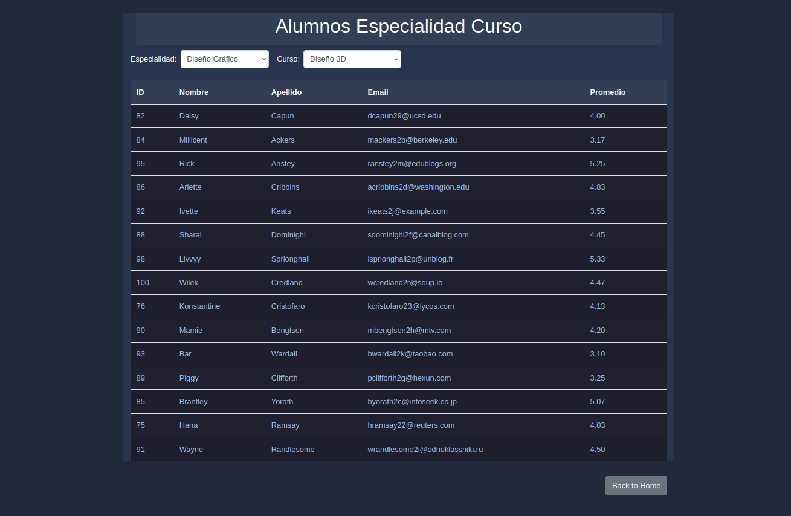

# UniversityAcademicModule

The University Academic Module is a Spring Boot application designed to manage academic operations within a university. This application provides functionalities for managing courses, students, faculty, departments, and enrollments.

## Table of Contents

- [Features](#features)
- [Technologies](#technologies)
- [Setup](#setup)
- [Usage](#usage)
- [Project Structure](#project-structure)
- [Detailed Description](#detailed-description)
  - [Services](#services)
  - [Repositories](#repositories)
  - [Controllers](#controllers)
  - [Static Resources](#static-resources)
  - [HTML Templates](#html-templates)
- [Contributing](#contributing)
- [License](#license)

## Features

- User authentication and authorization
- Course management with full CRUD operations
- Student enrollment and management
- Faculty and department management
- User management including roles and permissions

## Technologies

- **Java 11**: Core programming language used.
- **Spring Boot**: Framework for building the application.
- **Spring Security**: For authentication and authorization.
- **Thymeleaf**: Template engine for rendering HTML views.
- **MySQL**: Database used for persistent data storage.
- **Maven**: Build automation tool.

## Setup

### Prerequisites

- Java 11 or higher
- Maven
- MySQL

### Installation

1. Clone the repository.
2. Navigate to the project directory.
3. Configure the MySQL database:
    - Create a database for the application.
    - Update the `application.properties` file with your MySQL database credentials.
4. Install the dependencies using Maven.
5. Start the application using Maven.

## Usage

- Access the application through `http://localhost:8080`.
- Login using configured credentials.
- Use the web interface to manage courses, students, faculty, and departments.

## Project Structure

The project follows a standard Spring Boot structure with additional directories for static resources and templates.

- `src/main/java/com/university/module`: Contains the main application code.
  - `controller`: Contains the controllers handling HTTP requests.
  - `entity`: Defines the entities representing the database tables.
  - `repository`: Contains the repository interfaces for data access.
  - `service`: Contains the service classes implementing the business logic.
  - `UniversityApplication.java`: The main class to bootstrap the Spring Boot application.
- `src/main/resources`: Contains application resources.
  - `static`: Contains static assets like CSS and images.
  - `templates`: Contains Thymeleaf templates for rendering HTML views.
- `src/test`: Contains test classes.

```
UniversityAcademicModule
├── src
│   ├── main
│   │   ├── java
│   │   │   └── com/university/module
│   │   │       ├── controller
│   │   │       ├── entity
│   │   │       ├── repository
│   │   │       ├── service
│   │   │       └── UniversityApplication.java
│   │   ├── resources
│   │   │   ├── static
│   │   │   │   └── css
│   │   │   └── templates
│   │   │       ├── home
│   │   │       ├── actions
│   │   │       └── access-denied.html
│   └── test
│       └── java/com/university/module
├── .gitignore
├── README.md
└── pom.xml
```

## Detailed Description

### Services

The services contain the core business logic of the application. They interact with repositories to perform CRUD operations and other business-related tasks. For instance, `CourseService` handles operations related to courses, such as finding, saving, and deleting courses.

### Repositories

Repositories are responsible for data access. They provide an abstraction layer over the database, allowing the application to interact with data without directly using SQL queries. For example, `StudentRepository` manages CRUD operations for the Student entity.

### Controllers

Controllers handle incoming HTTP requests and return appropriate responses. They act as intermediaries between the frontend and the backend services. For example, `StudentController` manages requests related to student operations, directing users to the appropriate views.

### Static Resources

Static resources include assets such as CSS files, which are used to style the web pages. For example, the `login.css` file contains styles specific to the login page, enhancing the visual appearance of the login interface.

### HTML Templates

HTML templates are used to render dynamic web pages. Thymeleaf is used as the templating engine, allowing for integration with Spring's model attributes. For example, `access-denied.html` displays a message when a user tries to access a restricted page without the necessary permissions.

<p align="left">
  
  
  
</p>

## Contributing

Contributions are welcome. To contribute, please follow these steps:

1. Fork the repository.
2. Create a new branch.
3. Make your changes.
4. Commit your changes.
5. Push to your branch.
6. Open a pull request.

## License

This project is licensed under the MIT License.

---

This README provides a detailed overview of your project, its structure, and usage instructions. Feel free to customize it further based on your specific needs.

